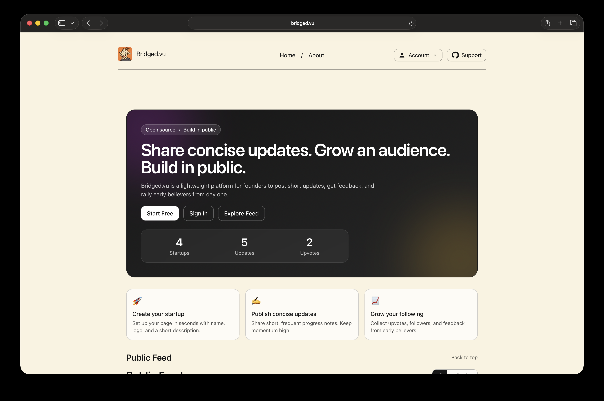

# Bridged.vu

Bridge the gap between users and founders early on. Share concise updates, grow an audience from day one, and build in public with signal over noise.

<p align="center">
  
  
  
  
  
  <br/>
  
  
  
</p>

<p align="center">
  
</p>

## Features

- Auth with email + password (bcrypt, secure session cookie)
- Founder dashboard: create startups and publish numbered “issues” (updates)
- Public feed (All / Following) with upvotes and follows
- Startup pages with updates; profile pages with follow
- Notifications and confetti for delightful feedback loops
- Postgres with plain SQL migrations (no ORM)
- Vercel Analytics and Speed Insights

## Requirements

- Node.js 18+ and npm
- A Postgres database (Supabase Postgres works great)

## Quickstart

```bash
git clone https://github.com/muhammadanas0716/bridged.vu
cd bridged.vu
cp .env.example .env.local
npm install

# Initialize DB schema
npm run migrate

# Dev server
npm run dev
```

Visit http://localhost:3000.

## Environment

Copy `.env.example` to `.env.local` and fill in values. Key variables:

- `POSTGRES_URL` — pooled connection string (recommended in serverless)
- `POSTGRES_URL_NON_POOLING` — direct connection (local/dev)
- `NEXT_PUBLIC_SITE_URL` — e.g. `http://localhost:3000`
- Optional: `SUPABASE_URL`, `SUPABASE_ANON_KEY` if you later add RLS/edge features

The app connects directly to Postgres using the `postgres` driver. SSL uses relaxed verification to work in common local/dev environments.

## Migrations

SQL migrations live under `migrations/` and are executed by a tiny runner.

```bash
npm run migrate
```

This creates and populates:

- `users`, `sessions`
- `startups`, `issues`
- `upvotes` with `vote_target` enum
- `follows`

No ORM is used; we keep the schema explicit and easy to audit.

## Architecture

- Next.js App Router
- Client components for interactive areas (forms, feed, upvotes)
- `lib/db.ts` — database client
- `lib/auth.ts` — user creation, hashing, sessions
- REST-style API routes under `app/api/**`

## Key Routes

- `/` — Public feed with All/Following and Load more
- `/dashboard` — Tabs for Overview, Startups, Profile
- `/p/[slug]` — Startup page + updates + upvote
- `/u/[handle]` — Profile + follow
- `/login`, `/signup`

## Deploy

- One‑click deploy to Vercel and set `.env` from your local `.env.example` values
- Ensure `POSTGRES_URL` or `POSTGRES_URL_NON_POOLING` is set (Supabase recommended)
- Add optional `NEXT_PUBLIC_GA_MEASUREMENT_ID` or `NEXT_PUBLIC_GSC_VERIFICATION`

## Scripts

- `dev` — run Next.js dev server
- `build` / `start` — production build / start
- `migrate` — run SQL migrations

## Contributing

We welcome contributions! Please see `CONTRIBUTING.md` for workflow, branching, and commit guidelines. All participants are expected to uphold our `CODE_OF_CONDUCT.md`.

## License

MIT — see `LICENSE`.

## Acknowledgements

Inspired by the build-in-public movement, Product Hunt’s card aesthetic, and the open-source community.
